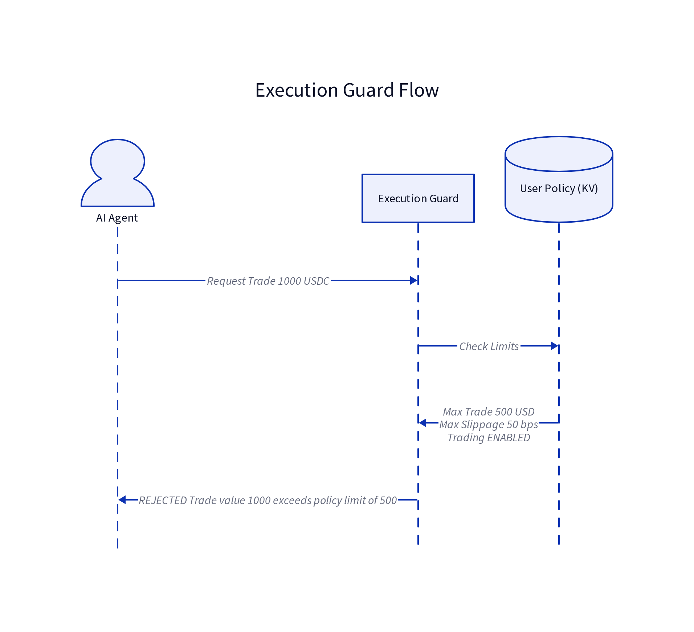
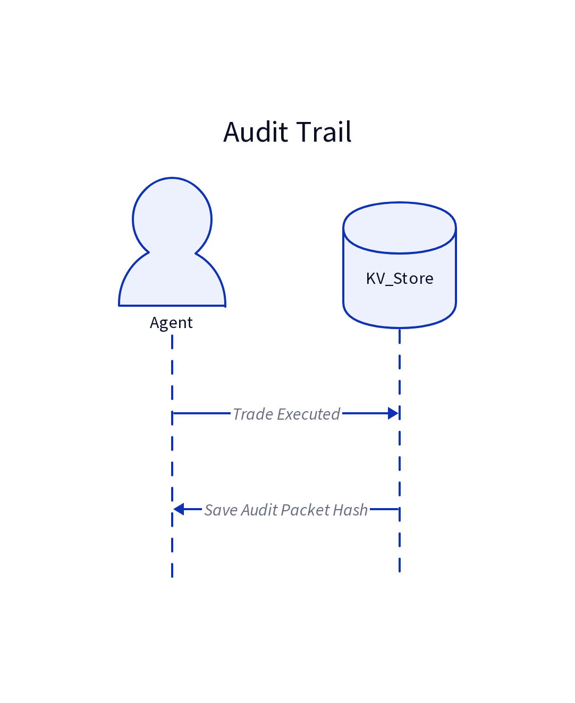

# AuxloNeo

**The edge-native AI agent.** Runs on Cloudflare Workers -- zero servers, global low-latency.

AuxloNeo is the stripped-down, edge-first version of [auxloclaw](https://github.com/Auxlo-xyz/auxloclaw). Where auxloclaw is a full daemon (35k lines, SQLite, subprocesses, WebSocket connections), AuxloNeo is ~6,000 lines of TypeScript that gives you a multi-provider AI agent with tool calling, session memory, and channel integrations -- all on Cloudflare.

## What you get

- **Brain & Muscle Architecture**: AuxloNeo uses a distributed intelligence model. The "Brain" (Cloudflare Worker) handles reasoning and memory, while the "Muscle" (AuxloMuscleCF Worker) provides native on-chain execution via viem -- connected through a Cloudflare service binding (no external HTTP hops).
- **Dual-Layer Memory**:
  - **Automatic Reflection**: Background analysis of conversations to learn preferences and facts across sessions.
  - **Explicit Memory**: Manual `remember` and `recall` tools for high-priority storage.
- **Context Compaction**: Automatic summarization of long conversations to keep tokens low while preserving context.
- **OpenAI-compatible API** at `/v1/chat/completions` (drop-in replacement for any OpenAI client)
- **Telegram bot** webhook handler with typing indicators and usage stats
- **Multi-provider LLM support**: OpenAI, Anthropic, Google Gemini, OpenRouter, Groq, DeepSeek
- **Built-in tools**:
  - `web_search` (DuckDuckGo)
  - `web_fetch` (URL reading)
  - `x_fetch` (X/Twitter)
  - `send_message` (Progress updates)
  - `current_time` (UTC timestamp)
  - `remember` / `recall` (Explicit memory)

## Mantle Network Autonomous Agent

AuxloNeo is now equipped with a fully autonomous on-chain suite for the **Mantle Network**. It doesn't just chat; it operates.

**What it can do for you on Mantle:**
- **Live Opportunity Scanning**: Automatically scans Mantle DeFi pools (via DefiLlama) to find the best yields.
- **Production-Grade Execution**: Swaps and deposits tokens using real on-chain tools with built-in **Slippage Guards** and **Dynamic Gas Protection**.
- **MEV Protection**: Supports Private RPC routing and Priority Fee boosting to prevent sandwich attacks and ensure transaction inclusion.
- **Portfolio Monitoring**: Tracks your positions in real-time, audits token balances, and claims rewards automatically.
- **Auto-Rebalancing**: Dynamically shifts assets between protocols to optimize returns based on live yield data.
- **Transparency**: Publishes its current agent state and heartbeat to Mantle Data Streams for public verification.

*Designed for the Mantle Turing Test Hackathon.*

## DeFi Intelligence Layer

Three subsystems power the autonomous DeFi agent. Each runs live against the Mantle network -- no mock data, no placeholders.

---

### 1. Portfolio State Engine

**Purpose**: Normalizes raw on-chain balances into a clean model the agent can reason about.

**Files**: `src/mantle/wallet/balances.ts`, `src/types.ts`

**What it does**:
- Fetches live native MNT balance via `eth_getBalance` RPC
- Fetches ERC-20 token balances via `eth_call` (no ethers.js deployment needed)
- Gets current MNT/USD price from CoinGecko (free, no key)
- Returns a `PortfolioSnapshot` with total value in USD

**Types**:
```typescript
interface Position {
  protocol: string;          // "wallet", "merchant-moe", "aave"
  token: string;             // "MNT", "USDC", "WMNT"
  tokenAddress: string;      // 0x... contract address
  balance: string;           // wei as string
  balanceFormatted: string; // human-readable (e.g., "100.5")
  valueUsd: number;         // current USD value
  apy: number;               // if staked/lent, the APY
  network: "mainnet" | "testnet";
  lastUpdated: number;       // epoch ms
}

interface PortfolioSnapshot {
  wallet: string;
  network: "mainnet" | "testnet";
  positions: Position[];
  totalValueUsd: number;
  nativeMnt: number;        // raw MNT balance
  nativeMntUsd: number;     // MNT value in USD
  timestamp: number;
}
```

**Live data sources**:
| Data | Source | Key needed? |
|------|--------|-------------|
| MNT balance | Mantle RPC (`eth_getBalance`) | No |
| Token balances | Mantle RPC (`eth_call` to ERC-20 contracts) | No |
| MNT price | CoinGecko `/simple/price` | No |

**How to use**: The agent calls `getPortfolioSnapshot(address, network, env)` and receives a fully-calculated snapshot. No manual hex parsing.

---

### 2. Protocol Discovery Engine

**Purpose**: Deep analysis of DeFi pools beyond just APR. Evaluates stability, liquidity depth, and risk.

**File**: `src/mantle/discovery.ts`

**Tool**: `mantle_discover_protocols`

**What it evaluates** (all live data):
- **APY Stability**: Compares current APY vs 30-day mean. High variance = unstable rewards.
- **TVL Health**: 7-day TVL change. Sharp drops = potential runaway risk.
- **Liquidity Depth**: Pools under $100K are "thin" and risky for large swaps.
- **Reward Emissions**: What % of APY comes from token emissions vs fees? High emissions = inflationary.
- **IL Risk**: Impermanent loss risk rating from DefiLlama.
- **Prediction Confidence**: ML-based APY trend prediction (DefiLlama provides this).

**Scoring formula**:
```
CompositeScore = 
  0.35 × min(APY, 200) +        // Cap at 200% to avoid farm-bait
  0.20 × StabilityScore +        // Higher = more consistent APY
  0.20 × TVLScore +              // log10(TVL) normalized
  0.15 × LiquidityBonus +        // "deep" > "medium" > "thin"
  0.10 × RewardSafetyBonus +     // Low emission ratio = safer
```

**Live data sources**:
| Data | Source | Key needed? |
|------|--------|-------------|
| Pool APY, TVL | DefiLlama `/pools?chain=Mantle` | No |
| Protocol TVL trends | DefiLlama `/protocols` | No |
| APY predictions | DefiLlama (embedded in pool data) | No |

**Example output**:
```
1. [merchant-moe] USDC-WMNT
   APY: 45.2% (stable: 92/100)
   TVL: $8.2M (7d: +12%)
   Liquidity: deep
   Reward emission: 30%
   Predicted trend: up (confidence: 78)
```

---

### 3. Wallet Abstraction Layer

**Purpose**: Every Mantle action uses the same wallet primitives. No scattered key handling, no duplicate signing logic.

**Files**: `src/mantle/wallet/`

| File | Function |
|------|----------|
| `create.ts` | `createWallet()` -- generate via MuscleCF, encrypt, store; `importWallet()` -- derive + store |
| `sign.ts` | `encryptUserKey()` / `decryptUserKey()` -- AES-256-GCM key encryption |
| `nonce.ts` | `getNonce()`, `getGasFees()` -- EIP-1559 fee estimation |
| `balances.ts` | `getPortfolioSnapshot()` -- unified balance query |
| `index.ts` | Barrel exports for all wallet ops |

**Encryption**: Private keys are encrypted with AES-256-GCM before storage in KV. The `WALLET_ENCRYPTION_KEY` secret (set via `wrangler secret put`) is the master key.

**Execution flow**:
1. Agent decides on an on-chain action (swap, lend, rebalance, etc.)
2. Worker decodes the user's encrypted private key from KV
3. Worker builds the transaction via `encodeFunctionData` (viem) -- contract calls, swaps, approvals
4. Worker submits the signed transaction to AuxloMuscleCF via the `MUSCLE` service binding (`/send-raw`, `/call`, `/approve` endpoints)
5. AuxloMuscleCF signs and broadcasts natively with viem -- no shell, no Node.js subprocess
6. Returns tx hash and MantleScan link

All on-chain tools (`mantle_swap`, `mantle_lend`, `mantle_auto_rebalance`, `mantle_execute_yield_strategy`, `mantle_publish_agent_state`) route through the same `muscleCall()` helper which uses the service binding directly.

**Session Grants** (non-custodial):
- User authorizes a **session key** with volume limits and expiration
- Agent can only sign transactions within those bounds
- Master wallet key never touched during normal operations

---

## How to Query

### Scan opportunities (basic)
```
User: "What Mantle pools have high APR?"
Tool: mantle_scan_opportunities
Returns: Top 10 pools filtered by APY/TVL
```

### Deep discovery (advanced)
```
User: "Which Mantle pools have high APR but deep liquidity?"
Tool: mantle_discover_protocols
Params:
  - minApr: 15        // minimum 15% APY
  - minTvl: 500000    // minimum $500K TVL
  - liquidityMin: "medium"  // or "deep"
Returns: Scored pools with stability, TVL trends, IL risk
```

### Check your portfolio
```
User: "What's my wallet worth on Mantle?"
Tool: mantle_monitor_positions
Returns: PortfolioSnapshot with all positions, total USD value
```

---

## Execution Guard Integration

These subsystems feed into the Execution Guard:

1. **Discovery** finds a pool with `APY: 45%`
2. **Guard** checks: `Is $500 < policy.maxTradeValue?` ✓
3. **Wallet** signs the deposit transaction
4. **Broadcast** submits to Mantle RPC

If any check fails, the agent stops and explains why.

---

## Architecture Diagram

```
User Query
    │
    ▼
┌─────────────────────┐
│  mantle_discover    │  ◀── DefiLlama API (live)
│  _protocols         │
└─────────┬───────────┘
          │
          ▼
┌─────────────────────┐
│  Execution Guard    │  ◀── Policy from CONFIG KV
│  (policy check)     │
└─────────┬───────────┘
          │
          ▼
┌─────────────────────┐
│  Wallet Layer       │  ◀── encrypt/decrypt/sign
│  (sign transaction) │
└─────────┬───────────┘
          │
          ▼
┌─────────────────────┐
│  Mantle RPC         │  ◀── Broadcast to network
│  (eth_sendRawTx)    │
└─────────────────────┘
```

---

## Architecture

### Brain & Muscle (Cloudflare-native)

AuxloNeo runs two Cloudflare Workers connected via a **service binding** — no Vercel, no shell runtime, no external HTTP hops.

```
┌──────────────────────┐        MUSCLE binding (in-CF)        ┌──────────────────────┐
│   AuxloNeo (Brain)   │  ─────────────────────────────────▶  │  AuxloMuscleCF       │
│   Cloudflare Worker  │     env.MUSCLE.fetch(...)            │  Cloudflare Worker   │
│                      │  ◀─────────────────────────────────  │                      │
│  - AI reasoning      │        JSON response                 │  - viem (native)     │
│  - tool calling      │                                      │  - /send  /balance   │
│  - session memory    │                                      │  - /wallet /call     │
│  - Telegram/OpenAI   │                                      │  - /send-raw /approve│
│    API               │                                      │  - /ledger /derive   │
└──────────────────────┘                                      └──────────────────────┘
         │                                                              │
         └──── KV (SESSIONS, MEMORY, CONFIG) ─────┐    ┌── Mantle RPC ──┘
                                                   ▼    ▼
                                          Cloudflare edge (global)
```

**Why this is better than the old Vercel `/exec` shell:**
- **No RCE surface**: The old `/exec` ran arbitrary shell commands (`child_process.exec`). The new Worker only exposes typed viem endpoints.
- **No cold starts**: Service bindings are in-CF, sub-millisecond latency.
- **Fail-closed**: If the `MUSCLE` binding is missing, tools error immediately instead of falling back to an external Vercel URL.
- **No secrets in transit**: API key auth stays inside Cloudflare's network.

### AuxloMuscleCF Endpoints

| Endpoint | Method | Purpose |
|----------|--------|---------|
| `/send` | POST | Send MNT (uses server key or provided `privateKey`) |
| `/send-raw` | POST | Broadcast a pre-signed raw transaction |
| `/balance` | POST | Get MNT balance for an address |
| `/wallet` | POST | Generate a new wallet (returns address + privateKey) |
| `/derive-address` | POST | Derive address from a private key |
| `/call` | POST | Read-only contract call (viem `readContract`) |
| `/approve` | POST | ERC-20 approve transaction |
| `/ledger` | POST | Chain info (block number, gas price) |

All endpoints require `x-api-key` header matching `MUSCLE_API_KEY`.

### Execution Guard (User-Scoped Policy Registry)



Every on-chain action from the agent must now pass a **Deterministic Policy Check**. You define your own risk limits—like a personal safety net. The agent is forbidden from exceeding them.

**How it works:**
1. You set a policy: *Max Trade $500, Max Slippage 1%, Only Merchant Moe*.
2. Agent decides to trade $600 → **REJECTED**.
3. Agent tries a $400 trade → **APPROVED**.

This moves AuxloNeo from an AI that "asks for permission" to an agent that operates within **hard, programmable boundaries**.

### Deterministic Signal Engine (No More Hallucinations)


The Trading Council no longer relies purely on AI "intuition". It starts with a **real data signal** from the **Treasury Signal Engine**.

**The Engine's job:**
1. Fetches live data from DefiLlama (oracles).
2. Runs a deterministic heuristic: *If pool_A Apr > pool_B Apr + 2%, then Signal Buy*.
3. Passes this opaque, data-driven recommendation to the Council.

The Council's role shifts from "guessing" to **auditing** a specific signal. This drastically reduces hallucination-based risk.

### Trading Council 2.0 (Data-Informed, Not AI-Led)

The council remains, but its workflow is now anchored.

**The New Flow:**
1. **Treasury Engine**: Emits "Buy MNT Pool - APY 23%".
2. **Analysts**: Audit this specific signal. "Is APY stable? Is the TVL real?".
3. **Strategist**: Crafts the exact plan.
4. **Guard**: Checks against your **Execution Guard** policy. **APPROVED**.
5. **Executor**: Runs the on-chain transaction.

### Verifiable Audit Trail (Institutional Trust)



Every Mantle on-chain action is now bundled into an **Audit Packet** and hashed for verifiable proof.

**Packet Contents:**
- `proposal`: The original Trading Plan.
- `outcome`: The real transaction result.
- `audit`: The Judge's verdict and score.
- `evidenceHashed`: SHA-256 hash of the above.

**Why it matters:**
- **Transparency**: You can see *exactly* why the agent made a trade.
- **Dispute Resolution**: A third party can verify the agent's reasoning without needing access to your raw session data.
- **Compliance Ready**: These hashes can be anchored on Mantle for a permanent, unchangeable record.


```
Request → index.ts (router) → Channel handler → agentChat() → Provider loop → Tools → Response
                                         ↕
                                    KV (sessions, memory, config)
                                         ↕
                                 Compression & Reflection
                                         ↕
                                 AuxloMuscleCF (service binding)
```

### Agent Loop


Each request flows through: load session → compact history → build context → call LLM → execute tools (up to 8 rounds) → save session → respond.

### Context Building


The system prompt includes the persona, active skills context, RLS grant info, and learned memories. Session history is auto-compacted. Tool definitions include built-in tools plus any active skill tools.

### Provider Resolution


Provider/model is resolved in order: request-level → session-level → environment default → hardcoded fallback (`openai`).

### Memory System


Three KV namespaces handle all persistence: **SESSIONS** (7-day TTL message history), **MEMORY** (30-day TTL user facts from reflection + explicit `remember`/`recall`), and **CONFIG** (global config, custom providers, per-session persona, skills, RLS grants, and usage tracking).

### Tool Execution


The agent executes tools in a loop (up to 8 rounds). Tool categories: **Web** (search, fetch), **Blockchain** (Mantle suite via AuxloMuscleCF service binding), **Messaging** (send_message), and **Utility** (current_time, remember, recall).

### Edge vs Traditional


Everything is stateless HTTP. No long-lived processes, no WebSocket connections, no filesystem, no databases. Cloudflare KV handles all persistence, and the AuxloMuscleCF Worker (bound via Cloudflare service bindings) handles all on-chain execution natively with viem -- no external shell runtime.

## Quick start

```bash
npm install
npm run dev        # local dev with wrangler
npm run deploy     # deploy to Cloudflare
```

## Configuration

### Secrets (set via `wrangler secret put`)

| Secret | Required | Description |
|--------|----------|-------------|
| `OPENAI_API_KEY` | One LLM key needed | OpenAI API key |
| `ANTHROPIC_API_KEY` | Alternative | Anthropic API key |
| `GOOGLE_API_KEY` | Alternative | Google Gemini API key |
| `OPENROUTER_API_KEY` | Alternative | OpenRouter API key |
| `GROQ_API_KEY` | Alternative | Groq API key |
| `DEEPSEEK_API_KEY` | Alternative | DeepSeek API key |
| `TELEGRAM_BOT_TOKEN` | For Telegram | Telegram bot token from @BotFather |
| `TELEGRAM_WEBHOOK_SECRET` | Recommended | Telegram webhook verification secret; incoming webhooks are verified when configured |
| `API_KEY` | Required for API/admin routes | Protects `/v1/chat/completions` and admin endpoints; protected routes fail closed if unset |
| `MUSCLE_API_KEY` | Required for Mantle tools | Authenticates calls to the AuxloMuscleCF Worker via the `MUSCLE` service binding |
| `WALLET_ENCRYPTION_KEY` | Required for wallet ops | AES-256-GCM master key for encrypting user private keys stored in CONFIG KV |

### KV namespaces (set in wrangler.toml)

Create three KV namespaces and bind them:

```bash
wrangler kv:namespace create SESSIONS
wrangler kv:namespace create MEMORY
wrangler kv:namespace create CONFIG
```

Update `wrangler.toml` with the generated IDs.

### Environment variables

| Variable | Default | Description |
|----------|---------|-------------|
| `DEFAULT_PROVIDER` | `openai` | Default LLM provider |
| `DEFAULT_MODEL` | provider default | Override default model |
| `DEFAULT_SYSTEM_PROMPT` | built-in | Custom system prompt |

## Endpoints

| Method | Path | Description |
|--------|------|-------------|
| `GET` | `/` | Health check + status |
| `POST` | `/v1/chat/completions` | OpenAI-compatible chat API |
| `POST` | `/api/chat/completions` | Alias for above |
| `POST` | `/telegram` | Telegram webhook handler |
| `POST` | `/admin/configure` | Update config (requires API_KEY) |
| `POST` | `/admin/setup-telegram` | Register Telegram webhook |

## Telegram setup

```bash
# 1. Set secrets
wrangler secret put TELEGRAM_BOT_TOKEN
wrangler secret put TELEGRAM_WEBHOOK_SECRET
wrangler secret put WALLET_ENCRYPTION_KEY

# 2. Deploy
npm run deploy

# 3. Register webhook
curl -X POST https://your-worker.workers.dev/admin/setup-telegram
```

## API usage

```bash
curl -X POST https://your-worker.workers.dev/v1/chat/completions \
  -H "Content-Type: application/json" \
  -H "Authorization: Bearer YOUR_API_KEY" \
  -d '{
    "model": "gpt-4o",
    "messages": [{"role": "user", "content": "Hello!"}],
    "session_id": "my-session"
  }'
```

With streaming:
```bash
curl -X POST https://your-worker.workers.dev/v1/chat/completions \
  -H "Content-Type: application/json" \
  -d '{
    "messages": [{"role": "user", "content": "Hello!"}],
    "stream": true
  }'
```

## Row-Level Security (RLS)

AuxloNeo implements per-user data isolation with opt-in cross-user sharing via access grants.

### How RLS Works


Every request is checked: if the user is the **owner**, full access is granted. Otherwise, the system checks for an active **access grant**. Grants with expired TTLs are auto-deleted.

### Permission Levels


- **Owner** -- full control (default for all resources you create)
- **Read** -- can only view data
- **Write** -- can view and edit
- **No Access** -- default for all other users

### Sharing Commands


**Telegram:**
- `/grant <userId> <resourceId> [permission] [days]` -- share your data
- `/revoke <grant_id>` -- remove access
- `/shares` -- list your active grants

### Sharing Example


User A grants temporary read access to User B. After the TTL expires, the grant is auto-deleted and access is revoked.

### Real-World Example


A support scenario: User A needs help, grants temporary access, User B assists, and access auto-expires after the specified duration.

## Try it now

Chat with the official AuxloNeo bot on Telegram:
👉 [t.me/AuxloNeo_bot](https://t.me/AuxloNeo_bot)

## What's stripped vs auxloclaw

| auxloclaw | AuxloNeo |
|-----------|----------|
| 35k lines Rust | ~6,000 lines TypeScript |
| SQLite memory | KV memory |
| Filesystem config | KV config |
| Subprocess tools (agent-browser, webserp) | Pure fetch (web_search, web_fetch) |
| Telegram long-polling / WebSocket | HTTP webhooks only |
| MCP server integration | None (future) |
| Scheduling / cron | Cloudflare Cron Triggers (future) |
| Voice I/O | None |
| Code execution | Native on-chain viem execution via AuxloMuscleCF |
| Docker / SSH environments | None |

## What's preserved

- Multi-provider LLM abstraction (6 providers)
- OpenAI-compatible API
- Tool calling loop with execution
- Session-based conversation memory
- Telegram channel integration
- Streaming responses
- Web search (DuckDuckGo)
- Automatic Memory & Context Compaction
- Native on-chain Mantle operations via AuxloMuscleCF service binding (swap, lend, yield strategy, auto-rebalance, audit proofs)

## License

MIT

This project is open source.

Made with ❤️ by Auxlo.xyz
