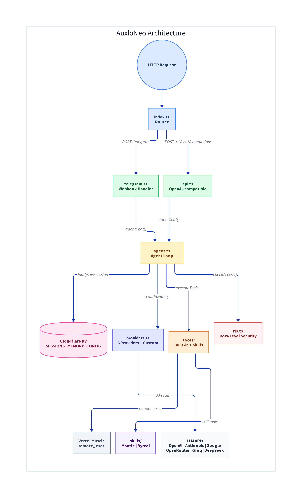
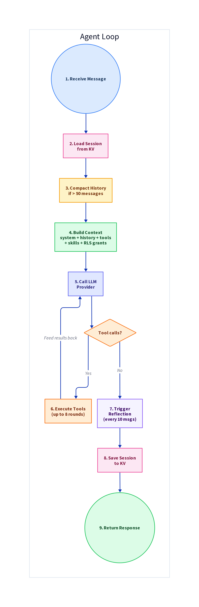
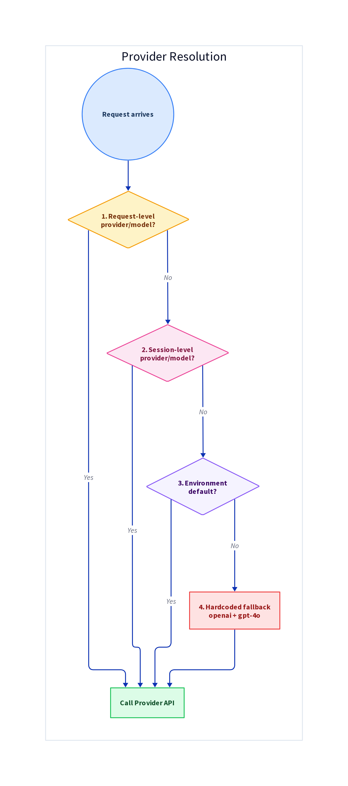
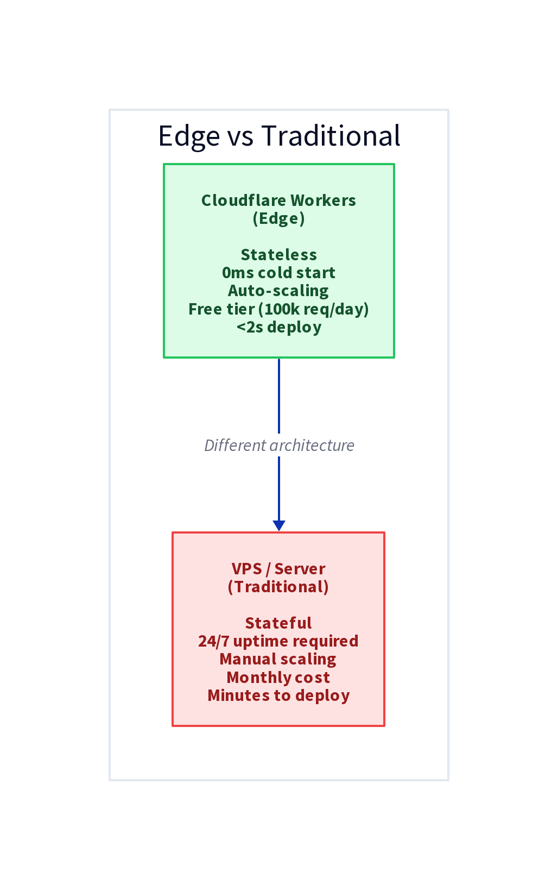
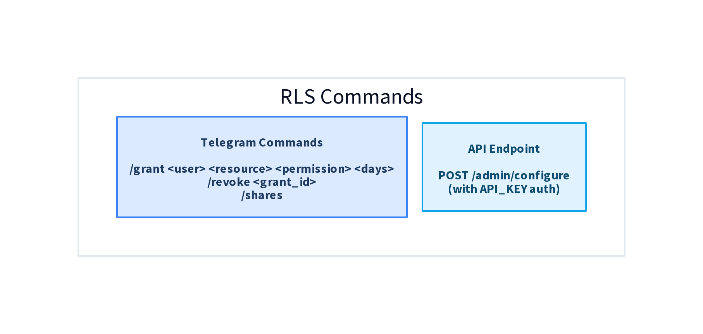

# AuxloNeo

**The edge-native AI agent.** Runs on Cloudflare Workers -- zero servers, global low-latency.

AuxloNeo is the stripped-down, edge-first version of [auxloclaw](https://github.com/Auxlo-xyz/auxloclaw). Where auxloclaw is a full daemon (35k lines, SQLite, subprocesses, WebSocket connections), AuxloNeo is ~6,000 lines of TypeScript that gives you a multi-provider AI agent with tool calling, session memory, and channel integrations -- all on Cloudflare.

## What you get

- **Brain & Muscle Architecture**: AuxloNeo uses a distributed intelligence model. The "Brain" (Cloudflare Worker) handles reasoning and memory, while the "Muscle" (Vercel Fluid Compute) provides a real Linux environment to execute CLI tools.
- **Dual-Layer Memory**:
  - **Automatic Reflection**: Background analysis of conversations to learn preferences and facts across sessions.
  - **Explicit Memory**: Manual `remember` and `recall` tools for high-priority storage.
- **Context Compaction**: Automatic summarization of long conversations to keep tokens low while preserving context.
- **OpenAI-compatible API** at `/v1/chat/completions` (drop-in replacement for any OpenAI client)
- **Telegram bot** webhook handler with typing indicators and usage stats
- **Multi-provider LLM support**: OpenAI, Anthropic, Google Gemini, OpenRouter, Groq, DeepSeek
- **Built-in tools**: 
  - `web_search` (DuckDuckGo)
  - `web_fetch` (URL reading)
  - `x_fetch` (X/Twitter)
  - `remote_exec` (Full CLI access: git, npm, python, ffmpeg, etc.)
  - `send_message` (Progress updates)
  - `current_time` (UTC timestamp)

## Mantle Network Autonomous Agent

AuxloNeo is now equipped with a fully autonomous on-chain suite for the **Mantle Network**. It doesn't just chat; it operates.

**What it can do for you on Mantle:**
- **Live Opportunity Scanning**: Automatically scans Mantle DeFi pools (via DefiLlama) to find the best yields.
- **Production-Grade Execution**: Swaps and deposits tokens using real on-chain tools with built-in **Slippage Guards** and **Dynamic Gas Protection**.
- **MEV Protection**: Supports Private RPC routing and Priority Fee boosting to prevent sandwich attacks and ensure transaction inclusion.
- **Portfolio Monitoring**: Tracks your positions in real-time, audits token balances, and claims rewards automatically.
- **Auto-Rebalancing**: Dynamically shifts assets between protocols to optimize returns based on live yield data.
- **Transparency**: Publishes its current agent state and heartbeat to Mantle Data Streams for public verification.

*Designed for the Mantle Turing Test Hackathon.*

## Architecture



```
Request → index.ts (router) → Channel handler → agentChat() → Provider loop → Tools → Response
                                         ↕
                                    KV (sessions, memory, config)
                                         ↕
                                 Compression & Reflection
                                         ↕
                                 Remote Executor (Vercel)
```

### Agent Loop



Each request flows through: load session → compact history → build context → call LLM → execute tools (up to 8 rounds) → save session → respond.

### Context Building


The system prompt includes the persona, active skills context, RLS grant info, and learned memories. Session history is auto-compacted. Tool definitions include built-in tools plus any active skill tools.

### Provider Resolution



Provider/model is resolved in order: request-level → session-level → environment default → hardcoded fallback (`openai`).

### Memory System


Three KV namespaces handle all persistence: **SESSIONS** (7-day TTL message history), **MEMORY** (30-day TTL user facts from reflection + explicit `remember`/`recall`), and **CONFIG** (global config, custom providers, per-session persona, skills, RLS grants, and usage tracking).

### Tool Execution


The agent executes tools in a loop (up to 8 rounds). Tool categories: **Web** (search, fetch), **Blockchain** (Mantle suite via Muscle), **Execution** (remote_exec), **Messaging** (send_message), and **Utility** (current_time, remember, recall).

### Edge vs Traditional



Everything is stateless HTTP. No long-lived processes, no WebSocket connections, no filesystem, no databases. Cloudflare KV handles all persistence, and Vercel Fluid Compute handles ephemeral CLI execution.

## Quick start

```bash
npm install
npm run dev        # local dev with wrangler
npm run deploy     # deploy to Cloudflare
```

## Configuration

### Secrets (set via `wrangler secret put`)

| Secret | Required | Description |
|--------|----------|-------------|
| `OPENAI_API_KEY` | One LLM key needed | OpenAI API key |
| `ANTHROPIC_API_KEY` | Alternative | Anthropic API key |
| `GOOGLE_API_KEY` | Alternative | Google Gemini API key |
| `OPENROUTER_API_KEY` | Alternative | OpenRouter API key |
| `GROQ_API_KEY` | Alternative | Groq API key |
| `DEEPSEEK_API_KEY` | Alternative | DeepSeek API key |
| `TELEGRAM_BOT_TOKEN` | For Telegram | Telegram bot token from @BotFather |
| `TELEGRAM_WEBHOOK_SECRET` | Optional | Webhook verification secret |
| `API_KEY` | Optional | Protects the `/v1/chat/completions` endpoint |

### KV namespaces (set in wrangler.toml)

Create three KV namespaces and bind them:

```bash
wrangler kv:namespace create SESSIONS
wrangler kv:namespace create MEMORY
wrangler kv:namespace create CONFIG
```

Update `wrangler.toml` with the generated IDs.

### Environment variables

| Variable | Default | Description |
|----------|---------|-------------|
| `DEFAULT_PROVIDER` | `openai` | Default LLM provider |
| `DEFAULT_MODEL` | provider default | Override default model |
| `DEFAULT_SYSTEM_PROMPT` | built-in | Custom system prompt |

## Endpoints

| Method | Path | Description |
|--------|------|-------------|
| `GET` | `/` | Health check + status |
| `POST` | `/v1/chat/completions` | OpenAI-compatible chat API |
| `POST` | `/api/chat/completions` | Alias for above |
| `POST` | `/telegram` | Telegram webhook handler |
| `POST` | `/admin/configure` | Update config (requires API_KEY) |
| `POST` | `/admin/setup-telegram` | Register Telegram webhook |

## Telegram setup

```bash
# 1. Set secrets
wrangler secret put TELEGRAM_BOT_TOKEN
wrangler secret put TELEGRAM_WEBHOOK_SECRET  # optional

# 2. Deploy
npm run deploy

# 3. Register webhook
curl -X POST https://your-worker.workers.dev/admin/setup-telegram
```

## API usage

```bash
curl -X POST https://your-worker.workers.dev/v1/chat/completions \
  -H "Content-Type: application/json" \
  -H "Authorization: Bearer YOUR_API_KEY" \
  -d '{
    "model": "gpt-4o",
    "messages": [{"role": "user", "content": "Hello!"}],
    "session_id": "my-session"
  }'
```

With streaming:
```bash
curl -X POST https://your-worker.workers.dev/v1/chat/completions \
  -H "Content-Type: application/json" \
  -d '{
    "messages": [{"role": "user", "content": "Hello!"}],
    "stream": true
  }'
```

## Row-Level Security (RLS)

AuxloNeo implements per-user data isolation with opt-in cross-user sharing via access grants.

### How RLS Works


Every request is checked: if the user is the **owner**, full access is granted. Otherwise, the system checks for an active **access grant**. Grants with expired TTLs are auto-deleted.

### Permission Levels


- **Owner** -- full control (default for all resources you create)
- **Read** -- can only view data
- **Write** -- can view and edit
- **No Access** -- default for all other users

### Sharing Commands



**Telegram:**
- `/grant <userId> <resourceId> [permission] [days]` -- share your data
- `/revoke <grant_id>` -- remove access
- `/shares` -- list your active grants

### Sharing Example


User A grants temporary read access to User B. After the TTL expires, the grant is auto-deleted and access is revoked.

### Real-World Example


A support scenario: User A needs help, grants temporary access, User B assists, and access auto-expires after the specified duration.

## Try it now

Chat with the official AuxloNeo bot on Telegram:
👉 [t.me/AuxloNeo_bot](https://t.me/AuxloNeo_bot)

## What's stripped vs auxloclaw

| auxloclaw | AuxloNeo |
|-----------|----------|
| 35k lines Rust | ~6,000 lines TypeScript |
| SQLite memory | KV memory |
| Filesystem config | KV config |
| Subprocess tools (agent-browser, webserp) | Pure fetch (web_search, web_fetch) |
| Telegram long-polling / WebSocket | HTTP webhooks only |
| MCP server integration | None (future) |
| Scheduling / cron | Cloudflare Cron Triggers (future) |
| Voice I/O | None |
| Code execution | Real-time Linux Execution via Remote Muscle |
| Docker / SSH environments | None |

## What's preserved

- Multi-provider LLM abstraction (6 providers)
- OpenAI-compatible API
- Tool calling loop with execution
- Session-based conversation memory
- Telegram channel integration
- Streaming responses
- Web search (DuckDuckGo)
- Automatic Memory & Context Compaction
- Full Linux CLI capabilities via Remote Execution

## License

MIT
