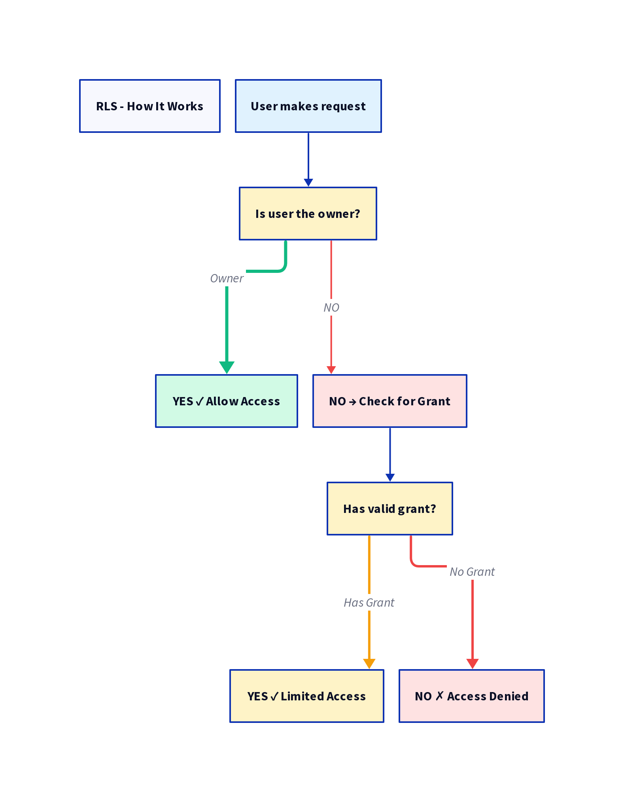
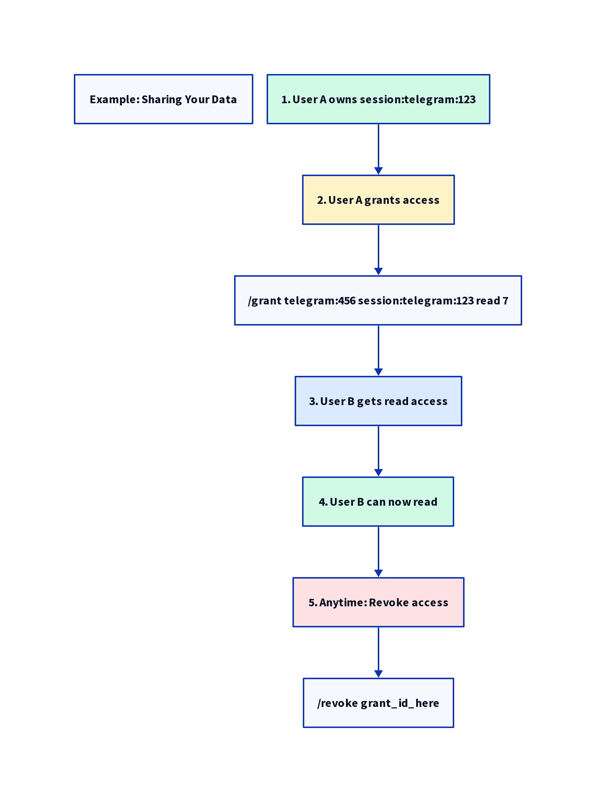
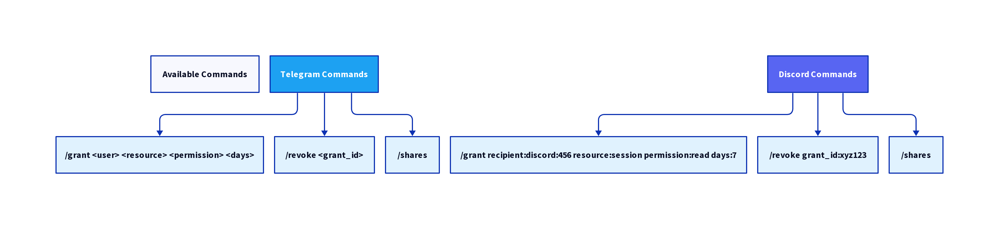
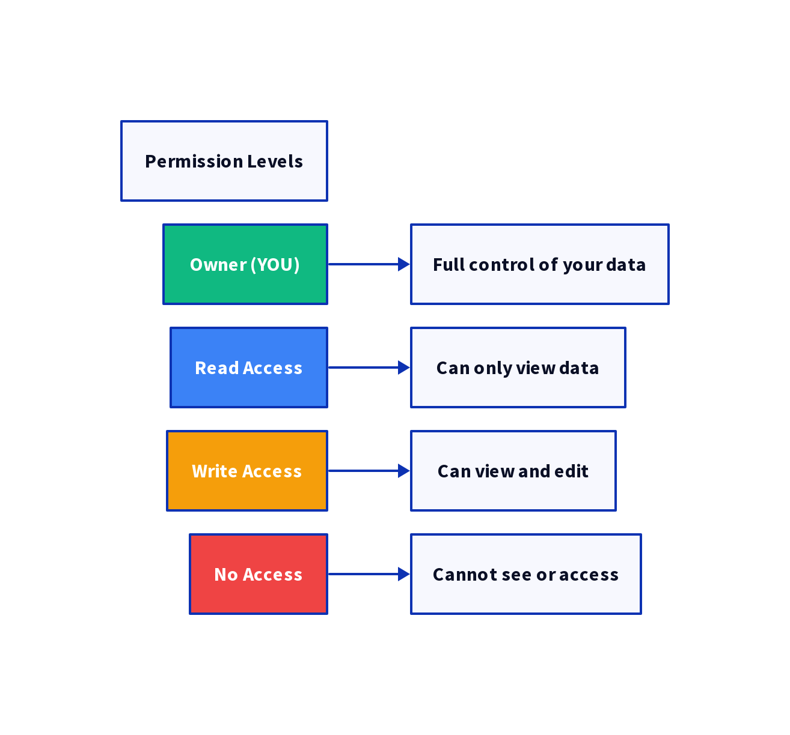
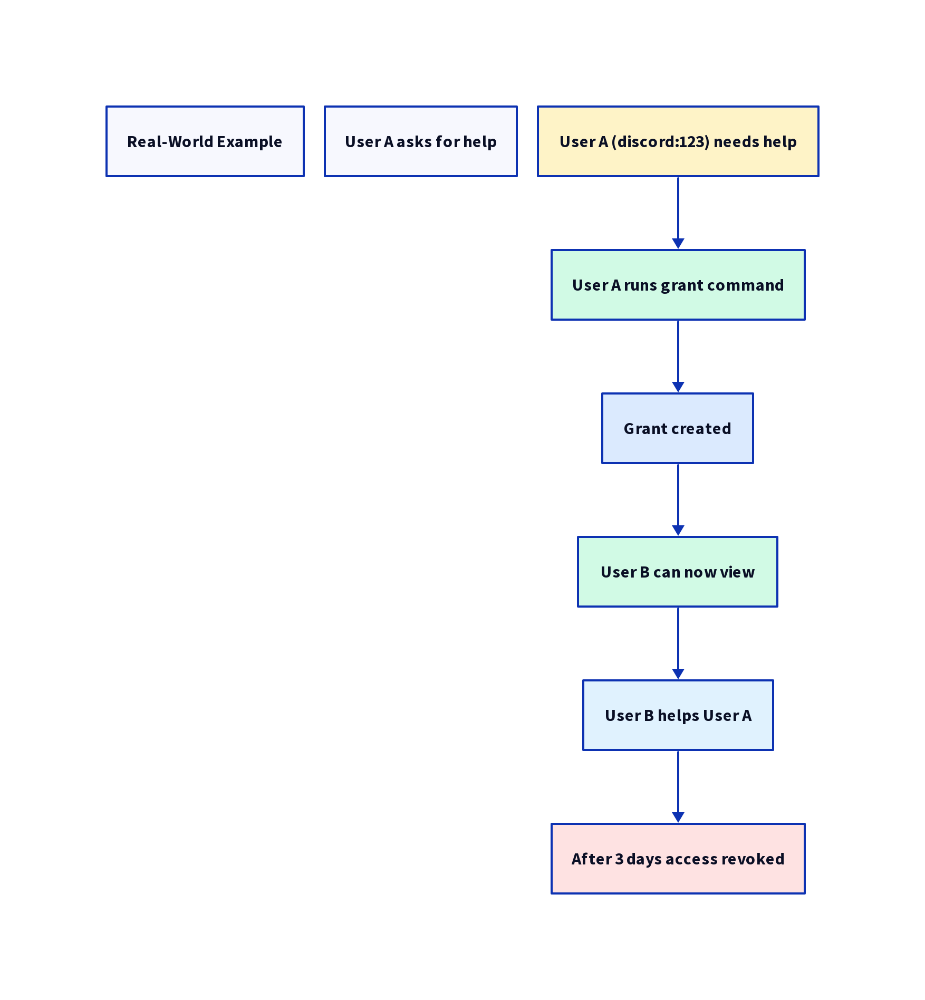
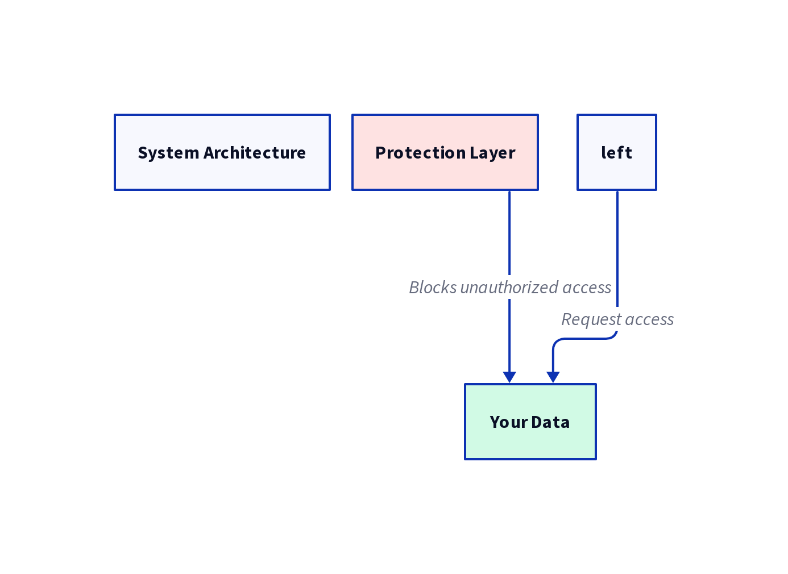

# Visual Guide: RLS Implementation

## Quick Overview

All diagrams are saved as PNG files in `/home/workspace/AuxloNeo/`

## 1. How RLS Works

**Simple flow:**
1. User makes request
2. System checks ownership
3. Access granted or denied

## 2. Example Usage

**Step-by-step:**
1. User A owns their data
2. User A grants access to User B
3. User B can now read
4. After expiration, access revoked

## 3. Available Commands

**Telegram & Discord both support:**
- `/grant` - Share your data
- `/revoke` - Remove access
- `/shares` - List permissions

## 4. Permission Levels

**Three levels:**
- **Owner** - Full control (default)
- **Read** - View only
- **Write** - Edit allowed

## 5. Real-World Example

**Scenario:**
1. User A needs help
2. Grants temporary access
3. User B helps
4. Access auto-expires

## 6. System Architecture

**Three layers:**
- Users (request access)
- Protection Layer (enforces rules)
- Your Data (stored securely)

---

## Key Points

✅ **Default**: Strict isolation (no access)
✅ **Opt-in**: Grant-based sharing
✅ **Temporary**: Auto-expiration supported
✅ **Cross-platform**: Telegram + Discord
✅ **Fine-grained**: Session or memory level
